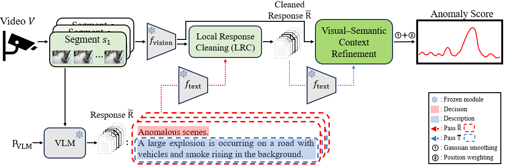

# CoReVAD: A-Contextual-Reasoning-Framework-for-Training-Free-Video-Anomaly-Detection

  

> <b>Abstract: </b>Existing Video Anomaly Detection (VAD) methods typically rely on task-specific training, leading to strong domain dependency and high training costs.
> Moreover, most existing methods output only scalar anomaly scores, providing limited insight into why specific events are considered abnormal.Recent advances in Vision–
> Language Models (VLMs) have enabled both anomaly detection and human-interpretable reasoning. However, many VLM-based approaches still require additional training steps
> (e.g., instruction tuning or verbalized learning) or external Large Language Models (LLMs), incurring further training costs and inference overhead. To address these
> challenges, we propose CoReVAD, a contextual reasoning framework for training-free video anomaly detection that operates with a single frozen VLM. CoReVAD directly generates
> anomaly scores and temporal descriptions from the VLM. To mitigate noise in generative outputs, we introduce a Local Response Cleaning (LRC) module based on local vision–
> text alignment. Furthermore, global temporal context and progression are incorporated through softmax-based refinement, Gaussian smoothing, and position weighting.
> Experiments on UCF-Crime and XD-Violence demonstrate that CoReVAD achieves competitive performance among training-free methods while providing reliable and interpretable
> explanations.

